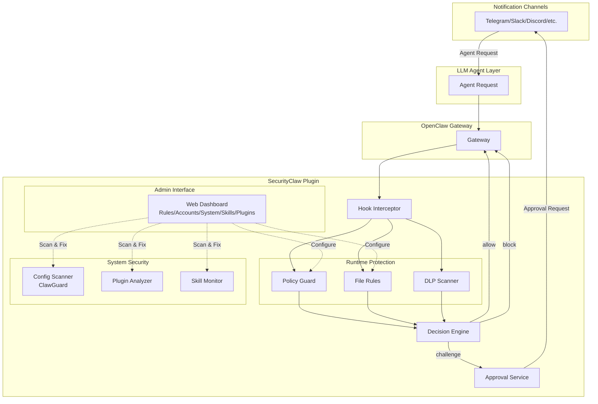
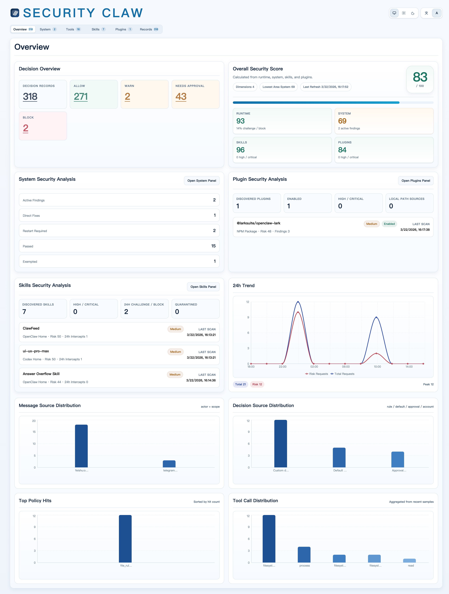
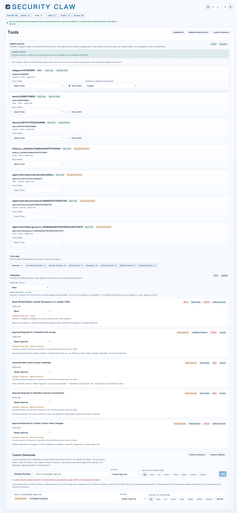
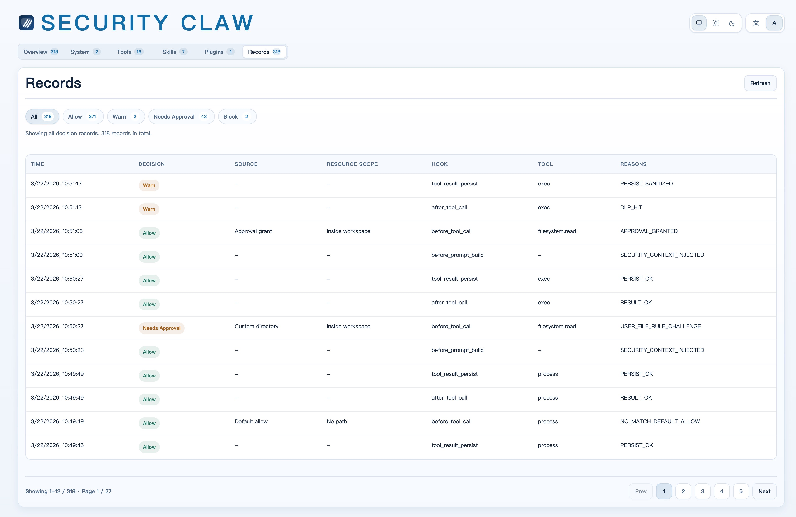
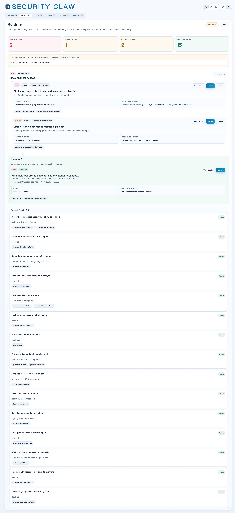
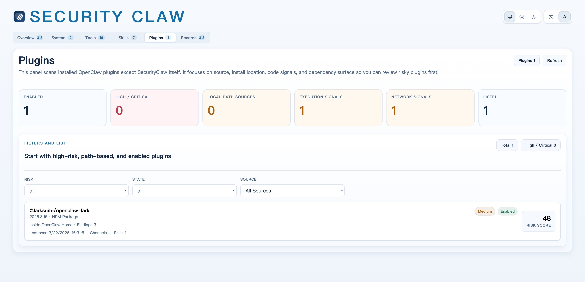
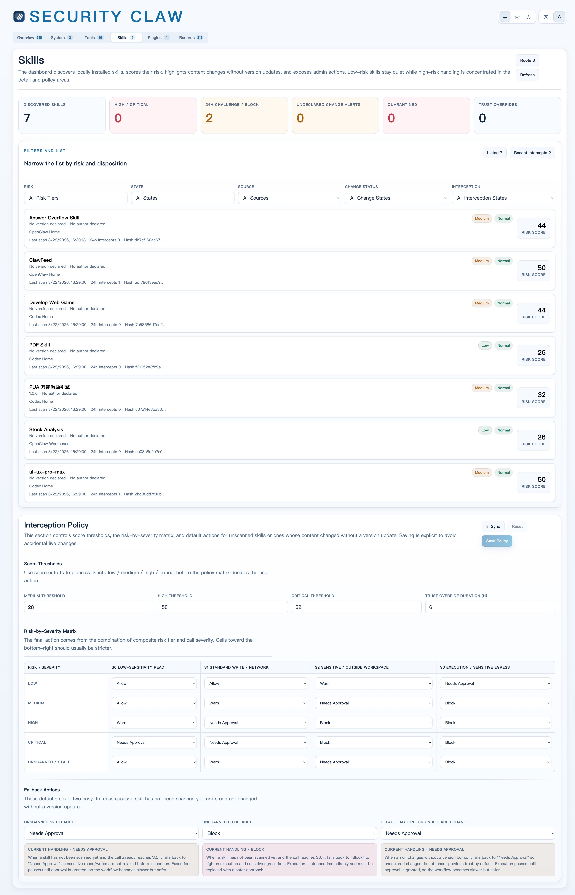

# SecurityClaw

[中文文档](./README.zh-CN.md)

> **Use OpenClaw on your primary machine with confidence.**

SecurityClaw is a comprehensive security plugin for [OpenClaw](https://github.com/openclaw/openclaw) that provides runtime policy enforcement, system hardening, and risk detection for LLM agents.

## What Problem Does It Solve?

LLM agents can execute powerful tools and access sensitive resources with minimal oversight. SecurityClaw provides multi-layered protection:

- **Runtime Protection**: Intercepts and evaluates every tool call against security policies
- **System Hardening**: Scans OpenClaw configuration for security misconfigurations
- **Plugin Security**: Analyzes installed plugins for risky code patterns and dependencies
- **Skill Monitoring**: Tracks custom skills for undeclared changes and high-risk operations
- **Approval Workflows**: Routes high-risk operations to admins for explicit confirmation
- **Data Protection**: Detects and masks sensitive data in outputs and logs

## Architecture



## Installation

```bash
npx securityclaw install
```

Or use the install script:

```bash
curl -fsSL https://raw.githubusercontent.com/znary/securityclaw/main/install.sh | bash
```

The admin dashboard will open automatically at `http://127.0.0.1:4780` after installation.

### Development Setup

```bash
git clone https://github.com/znary/securityclaw.git
cd securityclaw
npm install
npm run openclaw:dev:install
npm test
```

## Uninstall

```bash
openclaw plugins uninstall securityclaw
```

## Admin Dashboard

### Features

Access the web UI at `http://127.0.0.1:4780`:

**Overview Tab**: Real-time decision metrics, recent events, and system health

**Rules Tab**: View and edit policy rules, configure file rules, manage sensitive path patterns

**Accounts Tab**: Configure per-user/channel access modes, assign admin approvers, view active sessions

**System Tab (ClawGuard)**: Scan OpenClaw configuration for security risks, apply one-click fixes with preview

**Skills Tab**: View discovered skills with risk scores, quarantine or trust-override, configure interception policy

**Plugins Tab**: Analyze installed plugins, review risk signals (execution, network, dependencies)

**Events Tab**: Audit log of all security decisions with filtering

### Overview



The web-based admin dashboard provides centralized management and visibility into SecurityClaw's protection layers.

## Core Capabilities

### 1. Runtime Policy Enforcement



Intercepts tool calls at OpenClaw hook points and enforces security decisions:

- **Policy Rules**: Match by tool, operation, file path, asset label, data sensitivity
- **File Rules**: Path-based access control with operation-specific decisions
- **Approval Workflows**: Challenge high-risk operations with multi-channel notifications
- **DLP Engine**: Detect and mask PII, credentials, tokens in outputs
- **Audit Logging**: Structured decision events with trace IDs and reason codes



### 2. System Hardening (ClawGuard)



Scans OpenClaw configuration for security risks and provides automated fixes:

- **Gateway Security**: Checks bind address, authentication, service discovery
- **Sandbox Configuration**: Validates isolation boundaries and tool policies
- **Channel Access Control**: Reviews DM/group policies and allowlists
- **Workspace Bootstrap**: Audits SOUL.md for prompt injection defenses
- **One-Click Remediation**: Generates config patches with preview and rollback


### 3. Plugin Security Analysis



Discovers and analyzes installed OpenClaw plugins:

- **Risk Scoring**: Evaluates source, install location, code signals, dependencies
- **Code Pattern Detection**: Identifies execution capabilities, network access, file operations
- **Dependency Surface**: Maps npm dependencies and config requirements
- **Source Verification**: Flags local path sources and non-registry installs

### 4. Skill Interception & Monitoring



Tracks custom skills for security risks:

- **Content Drift Detection**: Alerts when skill content changes without version updates
- **Risk Matrix**: Combines skill risk tier with operation severity for dynamic decisions
- **Quarantine & Trust**: Manual override controls for high-risk or trusted skills
- **Activity Tracking**: Records skill invocations and interception events
- **Policy Thresholds**: Configurable score cutoffs and fallback actions

## Configuration

SecurityClaw uses a YAML policy file (`config/policy.default.yaml`) with runtime overrides stored in SQLite:

- **Policy Rules**: Match conditions (tool, operation, labels) and decisions
- **File Rules**: Path-based access control with operation-specific decisions
- **Sensitive Paths**: Map file patterns to asset labels
- **DLP Patterns**: Regex patterns for detecting and masking sensitive data
- **Account Policies**: Per-user/channel access modes and admin privileges
- **Skill Policy**: Risk thresholds, severity matrix, fallback actions

## License

MIT. See [LICENSE](./LICENSE).
