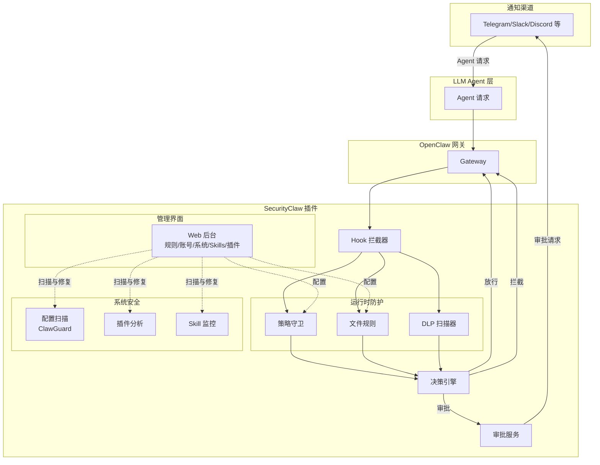

# SecurityClaw

[English](./README.md)

SecurityClaw 是面向 [OpenClaw](https://github.com/openclaw/openclaw) 的综合安全插件，提供运行时策略执行、系统加固和 LLM Agent 风险检测。

## 解决什么问题

LLM Agent 可以执行强大的工具并访问敏感资源，但缺乏监督。SecurityClaw 提供多层防护：

- **运行时防护**：拦截并评估每个工具调用的安全策略
- **系统加固**：扫描 OpenClaw 配置中的安全错误配置
- **插件安全**：分析已安装插件的风险代码模式和依赖
- **Skill 监控**：跟踪自定义 Skill 的未声明变更和高风险操作
- **审批流程**：将高风险操作路由给管理员进行明确确认
- **数据保护**：检测并脱敏输出和日志中的敏感数据

## 架构



## 核心能力

### 1. 运行时策略执行

在 OpenClaw Hook 点拦截工具调用并执行安全决策：

- **策略规则**：按工具、操作、文件路径、资产标签、数据敏感度匹配
- **文件规则**：基于路径的访问控制，支持操作级决策
- **审批工作流**：对高风险操作发起审批，支持多渠道通知
- **DLP 引擎**：检测并脱敏输出中的 PII、凭证、令牌
- **审计日志**：结构化决策事件，包含 trace ID 和原因码

### 2. 系统加固 (ClawGuard)

扫描 OpenClaw 配置中的安全风险并提供自动修复：

- **Gateway 安全**：检查绑定地址、认证、服务发现
- **沙箱配置**：验证隔离边界和工具策略
- **渠道访问控制**：审查私信/群聊策略和白名单
- **工作区引导**：审计 SOUL.md 中的提示注入防护
- **一键修复**：生成配置补丁，支持预览和回滚

### 3. 插件安全分析

发现并分析已安装的 OpenClaw 插件：

- **风险评分**：评估来源、安装位置、代码信号、依赖
- **代码模式检测**：识别执行能力、网络访问、文件操作
- **依赖面**：映射 npm 依赖和配置需求
- **来源验证**：标记本地路径来源和非注册表安装

### 4. Skill 拦截与监控

跟踪自定义 Skill 的安全风险：

- **内容漂移检测**：当 Skill 内容变更但版本未变时告警
- **风险矩阵**：结合 Skill 风险等级和操作严重度进行动态决策
- **隔离与受信**：对高风险或受信 Skill 的手动覆盖控制
- **活动跟踪**：记录 Skill 调用和拦截事件
- **策略阈值**：可配置的分数阈值和兜底动作

## 安装

```bash
npx securityclaw install
```

或使用安装脚本：

```bash
curl -fsSL https://raw.githubusercontent.com/znary/securityclaw/main/install.sh | bash
```

安装完成后，管理后台会自动打开 `http://127.0.0.1:4780`。

### 开发环境

```bash
git clone https://github.com/znary/securityclaw.git
cd securityclaw
npm install
npm run openclaw:dev:install
npm test
```

## 使用

### 管理后台

访问 `http://127.0.0.1:4780` Web UI：

**概览标签页**：实时决策指标、最近事件和系统健康状态

**规则标签页**：查看和编辑策略规则、配置文件规则、管理敏感路径模式

**账号标签页**：配置按用户/渠道的访问模式、分配管理员审批者、查看活跃会话

**系统标签页 (ClawGuard)**：扫描 OpenClaw 配置中的安全风险、应用一键修复并预览

**Skills 标签页**：查看已发现的 Skill 及风险评分、隔离或受信覆盖、配置拦截策略

**插件标签页**：分析已安装的插件、查看风险信号（执行、网络、依赖）

**事件标签页**：所有安全决策的审计日志，支持筛选

### 配置

SecurityClaw 使用 YAML 策略文件（`config/policy.default.yaml`），运行时覆盖存储在 SQLite 中：

- **策略规则**：匹配条件（工具、操作、标签）和决策
- **文件规则**：基于路径的访问控制，支持操作级决策
- **敏感路径**：将文件模式映射到资产标签
- **DLP 模式**：用于检测和脱敏敏感数据的正则表达式
- **账号策略**：按用户/渠道的访问模式和管理员权限
- **Skill 策略**：风险阈值、严重度矩阵、兜底动作

## 卸载

```bash
openclaw plugins uninstall securityclaw
```

## 许可证

MIT，详见 [LICENSE](./LICENSE)。
